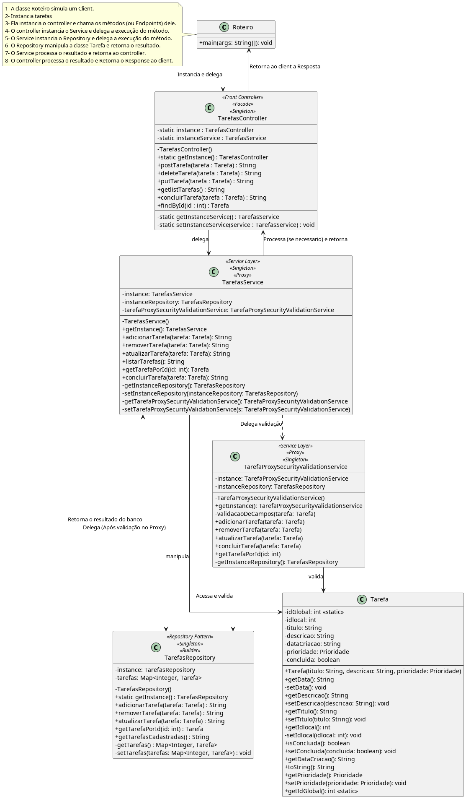

---
export_on_save:
  html: true
---

# Sistema de Gerenciamento de Tarefas (V 1.9)

---

## Indice

- [Sistema de Gerenciamento de Tarefas (V 1.9)](#sistema-de-gerenciamento-de-tarefas-v-19)
  - [Indice](#indice)
  - [Quadro de Versionamento](#quadro-de-versionamento)
  - [| **01/05/2025** | **09** | `Revisão da Documentação / Arquitetura `| Jabes Cajazeira](#-01052025--09--revisão-da-documentação--arquitetura--jabes-cajazeira)
  - [Descrição](#descrição)
  - [Objetivo](#objetivo)
  - [Funcionalidades](#funcionalidades)
  - [Descrição do Processo](#descrição-do-processo)
    - [Estrutura Do Repositório](#estrutura-do-repositório)
    - [Arquitertura](#arquitertura)
      - [Layred Arquiteture (Arquitetura Em Camadas)](#layred-arquiteture-arquitetura-em-camadas)
        - [**Interação entre as Camadas**](#interação-entre-as-camadas)
          - [UML](#uml)
  - [Padrões de Projetos](#padrões-de-projetos)
    - [Criacionais](#criacionais)
  - [Praticas Aplicadas](#praticas-aplicadas)
  - [Tecnologias Utilizadas](#tecnologias-utilizadas)
  - [Como Executar](#como-executar)
  - [Referencias:](#referencias)

---

## Quadro de Versionamento 

| Data       | Versão   | Alteração | Autor / Revisor
|------------|----------|-----------|---------|
|**25/10/2024**  |    01    | `- Idealização do Exercicio` |  Jabes Cajazeira  
|**01/04/2025**  |    02    | `- Definição e Aplicação de Padrões de Arquitetura` |  Jabes Cajazeira
|**06/04/2025**  |    03    | `- Aplicação de Padrões De Projeto ás regras de Negócio` | Jabes Cajazeira 
|**18/04/2025**  |    04    | `- Construção inicial da Documentação do Sistema` | Jabes Cajazeira
|**20/04/2025**  |    05    | `- Implementação do Padrão de Projeto: Proxy - de Proteção ` | Jabes Cajazeira
|**22/04/2025**  |    06   | `- Adição da Camada de Testes, Elaboração, Ajustes e Execução dos Testes com Maven e o Junit como Dependência Principal`  | Jabes Cajazeira 
| **24/04/2025** |  07 | `-  Revisão da documentação, execução dos testes ` | Jabes Cajazeira
| **29/04/2025** |  08 | `- Revisão da documentação, Revisão de Arquitetura` | Jabes Cajazeira
| **01/05/2025** | **09** | `Revisão da Documentação / Arquitetura `| Jabes Cajazeira
---

[Voltar ao Indice](#indice)

## Descrição 

O Sistema de Gerenciamento de Tarefas, partiu de um simples exercicio de estudo dos artificios e técnicas do Paradigma Orientado a Objetos, para uma ampliação a nivel Sistema, contendo:

- Design Orientado a Objetos. 
- Aplicação de Padrões Arquiteturias orientados a projeção do Sistema.
- Aplicação de Padrões de Projeto orientados a regra de negócio.
- Aplicação de Testes Unitários de Componentes.

---

[Voltar ao Indice](#indice)

##  Objetivo

O Objetivo derivado dessa Idealização, é visualizar uma possivel abstração de como na prática conceitos orientados a objetos são enxergados no backend das aplicações web, as quais estão implicitas nos frameworks desta natureza. 

Para tal estudo, usaremos como referência, Spring Boot e Quarkus - Frameworks Web Modernos experimentados pelo autor,os quais são utilizados na construções de Aplicações, API's REST, assim como, demais própositos inerentes as tecnologias, fornecendo serviços de: Criptografia, Autenticação, Conexão com banco de dados e técnicas, tecnologias, bibliotecas que se adequam as regras de négocio.

[Voltar ao Indice](#indice)

---

## Funcionalidades

Podemos inferir com base nas funcionalidades descritas que, a modelagem em sua excencia é um CRUD (Create, Read, Update, Delete) básico, o qual esses frameworks,
implementam de forma atõmica e verbosa tecnicas que se integram e gerenciam recursos computacionais. Alem as funcionalidades descritas induzirem a modelagem imperativa dos padrões, e mesmo que, tais implementações podem ser aplicaveis de forma mais enxuta (em Código Bruto), o objetivo é visualizar formas de aplica-los (quando justificaveis) de modo a conferir: Robustez, Eficiencia, Otimização de recursos, Maestria no dominio á excencia do Padrão orientado ao problema e aderência aos principios SOLID - evidendiando principalmente o Principio da Responsabilidade Única (SRP) em que cada classe possui apenas uma razão para existir . Nesse cenário, é requisito do sistema, gerir tarefas a partir das seguintes funcionalidades:

- Adicionar Tarefas.
- Listar tarefas.
- Concluir Tarefas.
- Atualizar taferas.
- Deletar Tarefas.

[Voltar ao Indice](#indice)

---

## Descrição do Processo 

### Estrutura Do Repositório

| Diretório   | Descrição   |
|----------|----------|
| `src/main/java/controller`  |   **Contem Controllers Responsaveis Centralizar as Requisições do Sistema**    |
| `src/main/java/data`  |   **Contem Repository's Reponsáveis pela Gerencia dos Dados**    | 
| `src/main/java/model`  |   **Contem Entidades que representam Abstrações de Objetos do Mundo Real**    | 
| `src/main/java/service`  |    **Contem Serviços com Regras de Négócio Aplicadas ao Cenário**    |
| `src/test/java`  | **Contem Testes Unitários realizados com os componentes do sistema**  |

### Arquitertura

#### Layred Arquiteture (Arquitetura Em Camadas)

A arquitetura do sistema segue o padrão **Layered Architecture**, que é uma extensão do **MVC (Model-View-Controller)**.

[^Pressman2021]
[^GAMMA]
O modelo contém todo o conteúdo e a lógica de processamento especícos à aplicação. A visão contém todas as funções especícas à interface e possibilita a apresentação do conteúdo e lógica de processamento exigido pelo usuário. O controlador gerencia o acesso ao modelo e à visão e coordena o uxo de dados entre eles. 

Nesse contexto, o sistema foi dividido em 4 camadas principais, cada uma com responsabilidades bem definidas:

- **Controller**:  
  Esta camada é a principal porta de entrada para a realização das funcionalidades. Ela é responsável por receber as requisições (considerando aplicações web ou outros tipos de interface) e direcioná-las para os processamentos específicos. No projeto, o `TarefasController.java` atua como um **Front Controller**, centralizando as operações e delegando a lógica de negócios para a camada de serviço.

- **Service (Service Layer)**:  
 
  Esta camada contém toda a lógica de negócios do sistema,[^Pressman2021] [...] fornecem  serviços utilitários e funções de software de aplicação [...]. É considerada a "alma" da regra de negócio, onde são descritas de forma imperativa todas as ações e funcionalidades. No projeto, o `TarefasService.java` centraliza operações como adicionar, atualizar, listar e concluir tarefas.  
  O uso do **Service Layer** desacopla a lógica de negócios da camada de controle, promovendo reutilização e manutenibilidade.

- **Data (Repository Pattern)**:

  Camada responsável pelo contato direto com os dados. Ela gerencia a persistência e recuperação de informações, seja em memória, arquivos ou banco de dados. No projeto, isso é implicito pelo `TarefasRepository.java`, que implementa o **Repository Pattern**.  

  [^Bergman] (Adaptado)  

  Esse padrão abstrai os detalhes de acesso aos dados, permitindo que o restante do sistema interaja com os dados de forma desacoplada. 
- **Model**:  
  Camada responsável pela gestão das entidades do sistema, sejam elas persistentes ou não. Além disso, o **Model** pode encapsular as regras de validação e garantir a integridade dos dados. No projeto, a classe `Tarefa.java` é um exemplo dessa camada, contendo validações como título e descrição obrigatórios.

Alem disso, cada camada (exceto a model) utiliza o artificio Generics adicionado no Java 5 que consiste em [^KUMAR] (Adaptado) um tipo genérico de classe ou interface que é parametrizada sobre tipos. Utilizamos suportes angulares (<>) para especificar o parâmetro de tipo. [...]. Dessa forma, no sistema em questão os contratos explicito nas interfaces das respectivas camadas podem implementados em futuras classes, evidenciando Boas Práticas do Principio de Inversão de Dependencia (DIP) - devido a pratica do uso de interfaces e Principio de Segregação de Interfaces (ISP), em que, nos temos uma segregação de interfaces, cada camada possui a sua em vez de uma contendo a abstração de todas. E por fim, o Principio Aberto Fechado (OCP) - nesse caso, as classes são abertas para extensão reutilzando ou não outros metodos para futuras implementações e fechado para modificações ao que ja possui.

##### **Interação entre as Camadas**

A interação entre as camadas segue os princípios do **MVC** e do **Layered Architecture**:
1. O **Controller** recebe as requisições e delega a lógica de negócios para o **Service**.
2. O **Service** utiliza o **Repository** para acessar ou persistir informações e o **Model** para manipular as entidades.
3. O **Repository** abstrai os detalhes de armazenamento, permitindo que o restante do sistema permaneça desacoplado da implementação específica de persistência.

###### UML 

[Voltar ao Indice](#indice)  

## Padrões de Projetos  

Conforme as funcionalidades, a nivel granular, podemos enxergar um CRUD Simples o qual a maioria dos frameworks como Quarkus, Spring Boot e demais, deixam de forma declarativa - ou seja, sem deixar transparente ao programador que tais passos podem ser executados. Sendo assim, de modo a abstrair de forma sucinta o funcionamento dos frameworks e aplica-los ao cenário, podemos visualizar os seguintes padrões de projeto. (front- controller (fachada - inpicito), singleton, Multiton, flyweight, Builder)

### Criacionais 

 - [Singleton](PadroesDeProjeto/Singleton.md)

[Voltar ao Indice](#indice)

---

## Praticas Aplicadas 

-  Solid
-  Dry
-  Testes Unitários de componentes com Junit

---

## Tecnologias Utilizadas 

- Java 23
- Junit 4.13.2
- Maven

[Voltar ao Indice](#indice)

--- 
## Como Executar

---

## Referencias:

[^GAMMA]: GAMMA, Erich. et al. Padrões de projetos: Soluções reutilizáveis de software orientados a objetos Bookman editora, 2009.

[^Pressman2021]: PRESSMAN, Roger S.; MAXIM, Bruce R. Engenharia de software: uma abordagem profissional [recurso eletrônico]. 9. ed. Porto Alegre: AMGH, 2021. E-pub. Tradução de Francisco Araújo da Costa. Revisão técnica de Reginaldo Arakaki, Julio Arakaki, Renato Manzan de Andrade. ISBN 978-65-5804-011-8. Editado também como livro impresso em 2021.

[^Bergman]: BERGMAN, Per-Erik. Repository Design Pattern. Medium, 20 abr. 2017. Disponível em: https://medium.com/@pererikbergman/repository-design-pattern-e28c0f3e4a30​. Acesso em: 29 abr. 2025.

[^KUMAR]:KUMAR, Pankaj. Java Generics Explained: Benefits, Examples, and Best Practice. DigitalOcean, 2022. Disponível em: https://www.digitalocean.com/community/tutorials/java-generics-example-method-class-interface. Acesso em: 29 abr. 2025.
