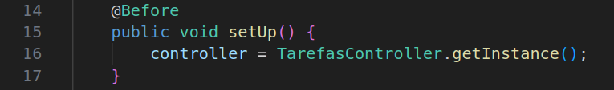

# Teste de Componentes - TarefasControllerTeste

## Sumário

- [Teste de Componentes - TarefasControllerTeste](#teste-de-componentes---tarefascontrollerteste)
  - [Sumário](#sumário)
  - [Considerações Técnicas](#considerações-técnicas)
  - [Pre-Condições para a execução dos testes](#pre-condições-para-a-execução-dos-testes)
  - [Casos de Teste](#casos-de-teste)
    - [CT1 - Teste de Cadastro de tarefas com sucesso `(testPostTarefa())`](#ct1---teste-de-cadastro-de-tarefas-com-sucesso-testposttarefa)
    - [CT2 - Teste de Cadastro de tarefa inválida `testPostTarefaFalha()`](#ct2---teste-de-cadastro-de-tarefa-inválida-testposttarefafalha)
    - [CT3 - Teste de conclusão de uma tarefa `testConcluirTarefa()`](#ct3---teste-de-conclusão-de-uma-tarefa-testconcluirtarefa)
    - [CT4 - Teste de listagem de tarefas `testGetTarefas()`](#ct4---teste-de-listagem-de-tarefas-testgettarefas)
    - [CT5 - Teste de busca de tarefa por ID `testGetTarefaById()`](#ct5---teste-de-busca-de-tarefa-por-id-testgettarefabyid)
    - [CT6 - Teste de busca de tarefa por ID inválido `testGetTarefaByIdInvalido()`](#ct6---teste-de-busca-de-tarefa-por-id-inválido-testgettarefabyidinvalido)
    - [CT7 - Teste de remoção de tarefa válida `testRemoverTarefa()`](#ct7---teste-de-remoção-de-tarefa-válida-testremovertarefa)
    - [CT8 - Teste de remoção de tarefa inexistente `testRemoverTarefaInvalida()`](#ct8---teste-de-remoção-de-tarefa-inexistente-testremovertarefainvalida)
    - [CT9 - Teste de atualização de tarefa válida `testAtualizarTarefa()`](#ct9---teste-de-atualização-de-tarefa-válida-testatualizartarefa)
    - [CT10 - Teste de atualização de tarefa inexistente `testAtualizarTarefaInvalida()`](#ct10---teste-de-atualização-de-tarefa-inexistente-testatualizartarefainvalida)
  - [Códigos dos testes:](#códigos-dos-testes)

## Considerações Técnicas 

Este documento explicita os casos de testes executados no componente **TarefasController** o qual simula a porta de entrada das requisições das aplicações web, nesse sentido, os Testes Unitários automatizados foram elaborados em concordância aos endpoints da classe.

Vale a pena ressaltar que, para a execução dos testes no geral, é necessário configurar minimamente o projeto para a execução dos testes, o qual pode ser feitas de várias estratégias:

1. Baixar a Lib do Junit .jar (no site oficial) e configurar as paths de Teste e de desenvolvimento do código para que o Java e a IDE (caso atual - VScode) estejam em harmonia e executar os testes manualmente, utilizando a biblioteca JUnit previamente adicionada ao repositório local.

2. Configurar o Projeto via Maven - estratégia aplicada no contexto atual, que consiste em: 

   1. Instalar o Maven na máquina
  
   2. Criar o `pom.xml` com toda a configuração do projeto e, além disso, as dependências **JUnit 4.13.2 e Hamcrest 1.3** para realizar os testes, demais configurações inerentes ao projeto (compilação e etc). Com isso, teremos algo semelhante a isso:
    
  
   3. Configuração do patch ambiente do projeto no Vscode, se não houverão erros de estruturação de Repositório e identificação de bibliotecas. Isso é feito criando a pasta `.vscode` na raiz do projeto contendo o **`settings.json`** com as seguintes descrições:
    
  
   4. Após essas configurações iniciais, só executar uma compilação inicial executando o comando `mvnw compile` no terminal para garantir o download das libs, configuração dos targets com as versões binárias dos códigos, e toda a configuração do projeto explícita no `pom.xml`.

   5. Com tudo configurado e compilado, e as libs em pleno funcionamento, é só modelar os casos de testes.
 
## Pre-Condições para a execução dos testes 

Para a execução de cada teste, é necessário instanciar o controller de tarefas para a realização de cada teste, uma vez que, antes da execução, o Junit precisa saber sob qual componente será efetuado as validações. Sendo assim, o seguinte método será executado antes dos testes para instanciar o controller:

## Casos de Teste

### CT1 - Teste de Cadastro de tarefas com sucesso `(testPostTarefa())`

**Identificação Única**: CT1.

**Objetivo do Teste**: Validar se o cadastro de tarefa foi executado corretamente.

**Passos para Execução**:

1. Instanciar a tarefa.
2. Chamar o controller executando o método `postTarefa`.
3. Conferir o resultado da comparação através do título usando o método `findbyId(...)` do controller.
   
**Critérios de Aceitação:** A Tarefa deve ser cadastrada com sucesso, com todos os atributos válidos.

### CT2 - Teste de Cadastro de tarefa inválida `testPostTarefaFalha()`

**Identificação Única**: CT2.

**V 1.10**
  
**Objetivo do Teste**: Verificar se o sistema lança exceção ao tentar cadastrar uma tarefa com título e descrição inválidos.  

**Passos para Execução**:
1. Instanciar uma tarefa com campos vazios.
2. Chamar o controller executando o método `postTarefa`.
3. Verificar se é lançada uma `IllegalArgumentException`.

**Critérios de Aceitação**:  
O sistema deve lançar uma exceção com **"O título da tarefa não pode ser nulo ou vazio."** impedindo o cadastro da tarefa inválida.

**V 2.0**

**Objetivo do Teste**: Verificar se o sistema impede o cadastro de tarefas com dados inválidos, lançando a exceção apropriada.

**Passos para Execução**:
1. Criar uma instância de `Tarefa` com título e descrição vazios (`""`).
2. Executar o método `postTarefa(tarefa)` via `TarefasController`.
3. Avaliar se a resposta contém a mensagem de erro esperada.

**Critérios de Aceitação**:
- O sistema deve impedir a criação da tarefa.
- Deve lançar uma `IllegalArgumentException` com a mensagem:
  > "O título da tarefa não pode ser nulo ou vazio."
  
---

### CT3 - Teste de conclusão de uma tarefa `testConcluirTarefa()`

**Identificação Única**: CT3. 

**V 1.10**
 
**Objetivo do Teste**: Validar se uma tarefa é marcada como concluída com sucesso.  

**Passos para Execução**:
1. Instanciar uma tarefa.
2. Cadastrar a tarefa usando o método `postTarefa`.
3. Executar o método `concluirTarefa`.
4. Conferir o estado da tarefa com `isConcluida()`.

**Critérios de Aceitação**:  
A tarefa deve estar com status de concluída.

**V 2.0**

**Objetivo do Teste**: Garantir que o sistema atualize corretamente o estado de uma tarefa para "CONCLUÍDA" após a execução da operação de conclusão.

**Passos para Execução**:
1. Criar uma instância de `Tarefa` com título, descrição e prioridade válidos.
2. Persistir a tarefa utilizando o método `postTarefa(tarefa)`.
3. Invocar `concluirTarefa(tarefa)` para alterar seu estado.
4. Recuperar a tarefa pelo método `findById(tarefa.getIdlocal())`.
5. Verificar se o estado da tarefa foi alterado para `EstadoTarefa.CONCLUIDA`.

**Critérios de Aceitação**:
- A tarefa deve ter seu estado atualizado para `CONCLUIDA`.
- A transição de estado deve ser persistente e verificável.

---

### CT4 - Teste de listagem de tarefas `testGetTarefas()`

**Identificação Única**: CT4.  
**Objetivo do Teste**: Validar se a listagem de tarefas está funcionando corretamente, retornando todas as cadastradas.  

**Passos para Execução**:
1. Cadastrar duas tarefas distintas.
2. Executar o método `getlistTarefas`.
3. Verificar se os títulos das tarefas aparecem na lista retornada.

**Critérios de Aceitação**:  
Os títulos das tarefas cadastradas devem estar presentes na string de retorno.

---

### CT5 - Teste de busca de tarefa por ID `testGetTarefaById()`

**Identificação Única**: CT5.  
**Objetivo do Teste**: Confirmar se a tarefa cadastrada pode ser localizada corretamente pelo ID.  

**Passos para Execução**:
1. Cadastrar uma nova tarefa.
2. Obter o ID da tarefa usando `getIdlocal()`.
3. Executar o método `findById` com esse ID.
4. Comparar se o objeto retornado é igual ao original.

**Critérios de Aceitação**:  
A tarefa retornada deve ser equivalente à tarefa cadastrada.

---

### CT6 - Teste de busca de tarefa por ID inválido `testGetTarefaByIdInvalido()`

**Identificação Única**: CT6. 

**V 1.10**

**Objetivo do Teste**: Validar se o sistema reage corretamente ao tentar buscar uma tarefa com ID inexistente.  

**Passos para Execução**:
1. Executar o método `findById` com um ID inexistente (ex: `999`).
2. Observar o lançamento de uma exceção.

**Critérios de Aceitação**:  
O sistema deve lançar uma exceção do tipo `IllegalArgumentException` com **"Tarefa não encontrada com o ID 999"**.

**V 2.0**

**Objetivo do Teste**: Garantir que o sistema lance a exceção correta ao tentar buscar uma tarefa com um ID que não está presente no repositório.

**Passos para Execução**:
1. Chamar o método `findById` com um valor de ID inexistente (`999`).
2. Verificar se o método lança uma `IllegalArgumentException`.
3. Confirmar que a mensagem da exceção contenha exatamente: `"Tarefa não encontrada com o ID 999"`.

**Critérios de Aceitação**:
- Deve ser lançada uma exceção do tipo `IllegalArgumentException`.
- A mensagem da exceção deve ser precisa e informativa: `"Tarefa não encontrada com o ID 999"`.

---

### CT7 - Teste de remoção de tarefa válida `testRemoverTarefa()`

**Identificação Única**: CT7.  

**V 1.10**

**Objetivo do Teste**: Validar se uma tarefa pode ser removida corretamente após ser cadastrada.  

**Passos para Execução**:
1. Instanciar uma tarefa.
2. Cadastrar a tarefa com `postTarefa`.
3. Executar `deleteTarefa` passando a tarefa como parâmetro.
4. Tentar buscar a tarefa removida usando `findById`.

**Critérios de Aceitação**:  
A tarefa deve ser removida com sucesso e não pode ser localizada posteriormente indicando que, **"Tarefa não encontrada com o ID 1"**.

**V 2.0**

**Objetivo do Teste**: Verificar se o sistema remove corretamente uma tarefa previamente cadastrada, e se essa remoção impede seu acesso posterior.

**Passos para Execução**:
1. Criar uma nova tarefa com dados válidos.
2. Cadastrar essa tarefa por meio do método `postTarefa`.
3. Remover a tarefa utilizando `deleteTarefa`.
4. Tentar recuperar a tarefa pelo seu ID com `findById`.
5. Verificar se o sistema lança uma exceção com a mensagem apropriada.

**Critérios de Aceitação**:
- Deve ser lançada uma exceção do tipo `IllegalArgumentException`.
- A mensagem da exceção deve conter exatamente:  
  `"Tarefa não encontrada com o ID <id_da_tarefa>"`, refletindo o ID da tarefa removida.

---

### CT8 - Teste de remoção de tarefa inexistente `testRemoverTarefaInvalida()`

**Identificação Única**: CT8.

**V 1.10**
  
**Objetivo do Teste**: Verificar se o sistema reage corretamente ao tentar remover uma tarefa que nunca foi cadastrada.  

**Passos para Execução**:
1. Instanciar uma tarefa (sem cadastrá-la).
2. Executar `deleteTarefa` com essa instância.

**Critérios de Aceitação**:  
O sistema deve lançar uma exceção `IllegalArgumentException` indicando que, **"A tarefa com o ID 1 não existe."**.

**V 2.0**

**Objetivo do Teste**: Garantir que o sistema retorne a mensagem apropriada ao tentar remover uma tarefa que não foi previamente cadastrada.

**Passos para Execução**:
1. Instanciar uma tarefa sem realizar seu cadastro.
2. Chamar o método `deleteTarefa` com essa instância.
3. Verificar se a mensagem retornada contém a indicação de que a tarefa não existe.

**Critérios de Aceitação**:
- A resposta do método deve conter a mensagem:  
  **"A tarefa com o ID `<id>` não existe."**
- Não deve ser lançada exceção: a falha é tratada como mensagem retornada.

---

### CT9 - Teste de atualização de tarefa válida `testAtualizarTarefa()`

**Identificação Única**: CT9.  
**Objetivo do Teste**: Validar se os dados de uma tarefa existente podem ser atualizados corretamente.  

**Passos para Execução**:
1. Instanciar e cadastrar uma tarefa.
2. Alterar atributos da tarefa (ex: `titulo`).
3. Executar `putTarefa`.
4. Validar se os dados foram atualizados com sucesso via `findById`.

**Critérios de Aceitação**:  
A tarefa deve refletir os novos dados após a atualização.

---

### CT10 - Teste de atualização de tarefa inexistente `testAtualizarTarefaInvalida()`

**Identificação Única**: CT10. 

**V 1.10**
 
**Objetivo do Teste**: Verificar se o sistema lança exceção ao tentar atualizar uma tarefa que não foi previamente cadastrada.  

**Passos para Execução**:
1. Instanciar uma tarefa (sem cadastrá-la).
2. Executar o método `putTarefa`.

**Critérios de Aceitação**:  
O sistema deve lançar uma exceção `IllegalArgumentException` indicando que, **"A tarefa com o ID 1 não está cadastrada."**.

**V 2.0**

**Objetivo do Teste**: Verificar se o sistema responde adequadamente ao tentar atualizar uma tarefa que nunca foi cadastrada.

**Passos para Execução**:
1. Instanciar uma tarefa com dados válidos.
2. Não cadastrá-la previamente no sistema.
3. Executar `putTarefa` com essa tarefa.
4. Verificar se a resposta textual indica a inexistência da tarefa.

**Critérios de Aceitação**:
- O método deve retornar uma mensagem contendo:  
  **"A tarefa com o ID `<id>` não está cadastrada."**
- A operação não deve alterar o estado do sistema.

## Códigos dos testes:

[CódigosTest](../../src/test/java/TarefasControllerTest.java)

[Voltar Principal](../../README.md)