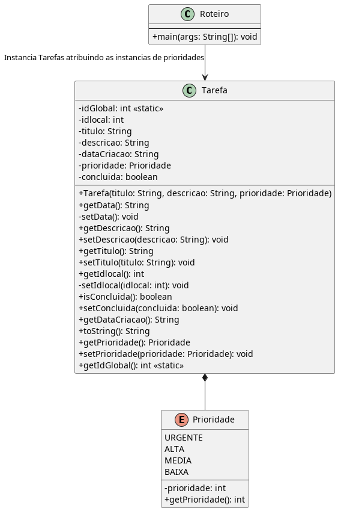

# Multiton (Não GOF)

## Intenção

[^K19]
Permitir a criação de uma quantidade limitada de instâncias de determinada classe e fornecer um modo para recuperá-las.

---

## Motivação 

Tendo em vista que, o Multiton é uma variação do Singleton e que o Enum do Java se comporta como um Multiton, no contexto do sistema, ele ainda possui uma relação fraca com o mesmo, no sentido de que, é aplicável, porém a razão atribuída a ele é a representação de instâncias únicas da classe Prioridade (Alta, Média, Baixa e Urgente) o que justifica, mas é possível fundamentar um pouco mais a aplicabilidade, de modo a conferir, exatidão da implementação. O acesso é centralizado e consistente, evitando duplicidade e facilitando a manutenção.

---

## Estrutura

---

### Código

---

## Participantes

1. **Multiton:** `(Prioridade)` -> mantém instâncias únicas para cada Prioridade das Tarefas;
2. **Client:** `(Roteiro)`
    - O Roteiro chama as instâncias em tempo de execução para atribuir as tarefas.

---

## Conclusão

O padrão Multiton, embora não seja formalmente descrito pelo GoF, surge como uma solução eficaz quando é necessário controlar e centralizar múltiplas instâncias únicas, representando conceitos fixos, porém distintos — como no caso das prioridades de tarefas. Sua aplicação por meio de enum no Java é elegante, concisa e semanticamente forte, trazendo legibilidade, segurança e garantia de unicidade.

Ao utilizá-lo no domínio do sistema, transformamos o que seria uma simples enumeração em um repositório conceitual imutável, onde cada instância carrega não só um valor, mas um significado funcional dentro do fluxo de tarefas. Essa prática reforça o controle sobre a criação de objetos, garantindo consistência, clareza arquitetural e uma lógica de acesso compartilhada e segura.

Assim, o Multiton se estabelece como uma variação prática do Singleton, alinhado ao espírito da engenharia de software moderna: preciso, reutilizável e semanticamente expressivo.

[Voltar Principal](../../README.md)

--- 

## Referências:

[^K19]: KASPCHUK, Alexandre; PLEIN, Tiago. K19 - Design Patterns em Java. São Paulo: K19 Treinamentos, 2012.