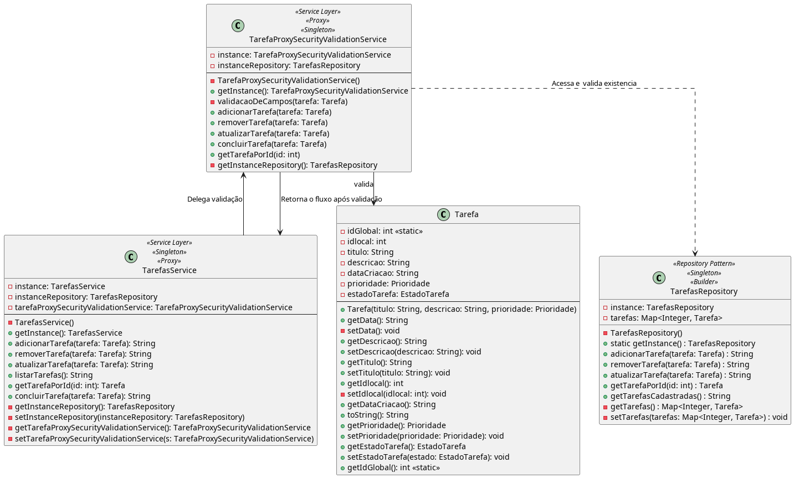

# Proxy

## Intenção

[^GAMMA]
Fornece um substituto (surrogate) ou marcador da localização de outro objeto para controlar o acesso a esse objeto.

---

## Motivação

[^GAMMA]
Uma razão para controlar o acesso a um objeto é adiar o custo integral de sua criação e inicialização até o momento em que realmente necessitamos usá-lo.

Considere o cenário atual, em que, precisamos proteger o acesso das requisições da camada de controller para a camada de serviço com validações de objetos de entrada e demais funcionalidades inerentes a camada de serviço. 

Por exemplo, em **Spring Boot**, a anotação `@valid` valida tanto o objeto, quanto seus atributos, basta adicionar anotações especificas (`@NotNull`, `@NotBlank` ...) para cada atributo da entidade na camada de models, de modo a , garantir a integridade dos dados. Ao receber a requisição do controller, o método respectivo adota o `@valid`em seus parâmetros, de modo a, validar o corpo das requisições. Em caso de invalidação, demais ações referentes a solicitação não poderão ser realizadas, **protegendo a camada de ações incoerentes e indesejadas**.

Podemos inferir que, com base nesse fluxo de ações, essa abordagem e especificidade do framework reflete um **Proxy de Proteção**, em que, conforme visto, há uma proteção de acesso ao outra camada.

Nesse sentido, extraindo a essência dessa implementação para o contexto do Gerenciador de Tarefas,  uma possível abstração desses detalhes é visualizada na classe `TarefaProxySecurityValidationService`. Vale a pena ressaltar que, trata-se **de uma variação do padrão descrito pelo GOF**, uma vez que, na implementação o proxy não delega as ações a camada de serviço, ele **se passa pelo serviço** na intenção de apenas validar as ações e retorna o fluxo a camada de serviço, nisso, ele se comporta como um Proxy e tal aplicação também se adequa a seus princípios, entretanto, estruturalmente, em respeito ao façade, ele teve de ser adaptado. Em caso de invalidez, é estourado uma excessão de modo a, proteger o fluxo e o acesso a outras camadas.

---

## Estrutura

### Código

[CódigoProxy](../../src/main/java/service/TarefaProxySecurityValidationService.java)

---

## Participantes

[^GAMMA] (Adaptado)

- Proxy (TarefaProxySecurityValidationService)
  - È uma referencia ao o objeto real (real subject). O proxy pode referenciar um Subject se as interfaces de RealSubject e Subject forem as mesmas. No gerenciador, embora não aplicado rigorosamente, é subentendido a semelhança entre o RealSubject e Subject (em futuras implementações pode ser ajustado);
  - fornece uma interface idêntica a de Subject, de modo que o proxy possa substituir o objeto real (real subject).
  - controla o acesso ao objeto real e pode ser responsável pelo acesso e pela negação do acesso a camada.
  - outras responsabilidades dependem do tipo de proxy:
  - remote proxies são responsáveis pela codificação de uma solicitação e de seus argumentos, bem como pelo envio da solicitação codificada para o objeto real num espaço de endereçamento diferente; 
    - protection proxies verificam se quem chama tem as permissões de acesso requeridas para executar uma consulta.
- Subject (Seria o Service<T>)
  - define uma interface comum para RealSubject e Proxy, de maneira que um Proxy possa ser usado em qualquer lugar em que um RealSubject é esperado.
- RealSubject (TarefasService)
  - Define o objeto real que o proxy representa.

---

## Conclusão

O padrão Proxy, quando adaptado ao contexto de segurança e validação, como feito na classe TarefaProxySecurityValidationService, revela sua flexibilidade estrutural e semântica. Ainda que sua aplicação neste caso se afaste da forma clássica descrita por Gamma et al., a essência está preservada: interceptar o acesso a um serviço real com a intenção de controlar, validar ou restringir esse acesso.

Na arquitetura proposta, o Proxy funciona como uma barreira lógica, garantindo que apenas dados íntegros e comportamentos válidos transitem entre as camadas do sistema. Essa adaptação é particularmente eficaz em frameworks modernos como o Spring Boot, onde anotações como @Valid e validações baseadas em Bean Validation já operam como proxies implícitos.

Portanto, mesmo que a implementação fuja do rigor estrutural do GoF — substituindo a delegação direta por uma atuação quase transparente no fluxo — ela cumpre a missão arquitetônica do padrão Proxy com precisão: proteger, abstrair e controlar o acesso ao núcleo funcional da aplicação, reforçando o compromisso com segurança, clareza e manutenção da integridade sistêmica.

---

## Referências:

[^GAMMA]: GAMMA, Erich. et al. Padrões de projetos: Soluções reutilizáveis de software orientados a objetos Bookman editora, 2009.

[Voltar Principal](../../README.md)