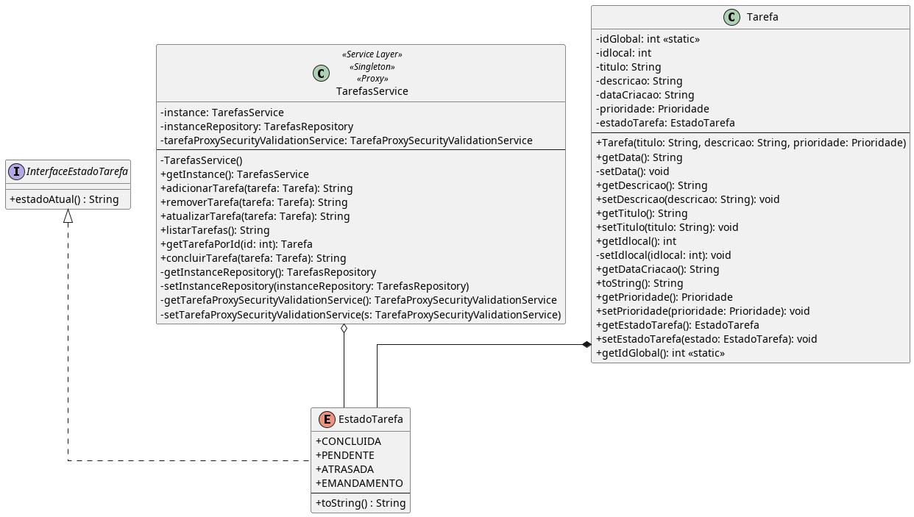

# State

## Intenção 

[^GAMMA]

Conhecido como **Objects for States.**

Permite a um objeto alterar seu comportamento quando o seu estado interno muda. O objeto parecerá ter mudado sua classe.

---

## Motivação 

Em conformidade com a intenção, no sistema em questão uma de suas funcionalidades é concluir uma tarefa. Isso implica, alterar o estado comportamental da tarefa para conferir tal alteração. Nesse sentido, o padrão comportamental state se adequa como forte candidato para a implementação dessas alterações de estado. Utilizamos a classe `EstadoTarefa.java` como um Multiton, instanciando diferentes objetos representando os estados comportamentais possíveis: CONCLUIDO, EMANDAMENTO, PENDENTE e ATRASADA. No nosso cenário, há uma adaptação para que o estado faça parte da Tarefa (`Tarefa.java`) - o que antes era um retorno booleano **isConcluida()** e a gerência dos estados fique sob a responsabilidade da classe `TarefasService.java` conforme a estrutura a seguir.

---

## Estrutura

---

## Códigos

[^GUERRA] (Adaptado)

**InterfaceEstadoTarefa**

[CodigoInterface](/src/main/java/model/InterfaceEstadoTarefa.java)

**EstadoTarefa**

[EstadoTarefa](/src/main/java/model/EstadoTarefa.java)

---

## Participantes 

[^GAMMA] (Adaptado)

- **Context** (`Tarefa.java`)
  - define a interface de interesse para os clientes.
  - mantém uma instância de uma subclasse ConcreteState que define o estado corrente.
- **State** (`InterfaceEstadoTarefa.java`)
  - define uma interface para encapsulamento associado com um determinado estado do Context.
- **ConcreteState subclasses** (`EstadoTarefa.Java`)
  - Contem cada  objeto que implementa um comportamento associado com um estado do Context.

---

## Conclusão 

A aplicação do padrão State neste sistema evidencia uma solução elegante e escalável para tratar mudanças de comportamento de uma tarefa conforme seu estado. 

Ao encapsular os estados dentro de uma estrutura enumerada que implementa uma interface comum, garantimos coesão e clareza sem comprometer a extensibilidade. Isso facilita a manutenção do código, a adição de novos estados no futuro e preserva o princípio da responsabilidade única em cada classe envolvida. 

Em suma, a utilização do State Pattern foi essencial para alinhar o design do sistema às boas práticas da orientação a objetos.

[Voltar Principal](../../README.md)

---

## Referencias:

[^GAMMA]: GAMMA, Erich. et al. Padrões de projetos: Soluções reutilizáveis de software orientados a objetos Bookman editora, 2009.

[^GUERRA]: GUERRA, Eduardo. *Design Patterns com Java*. Casa Do Código.