# Relatório de Testes

## Índice de Relatórios

- [Relatório de Testes](#relatório-de-testes)
  - [Índice de Relatórios](#índice-de-relatórios)
  - [CT1 - Teste de Cadastro de tarefas com sucesso `(testPostTarefa())`](#ct1---teste-de-cadastro-de-tarefas-com-sucesso-testposttarefa)
    - [Evidências:](#evidências)
    - [Barema:](#barema)
  - [CT2 - Teste de Cadastro de tarefa inválida `(testPostTarefaFalha())`](#ct2---teste-de-cadastro-de-tarefa-inválida-testposttarefafalha)
    - [V 1.10](#v-110)
      - [Evidências:](#evidências-1)
      - [Barema:](#barema-1)
    - [V 2.0](#v-20)
      - [Evidências:](#evidências-2)
      - [Barema:](#barema-2)
  - [CT3 - Teste de Conclusão de Tarefa `(testConcluirTarefa())`](#ct3---teste-de-conclusão-de-tarefa-testconcluirtarefa)
    - [V 1.10](#v-110-1)
      - [Evidências:](#evidências-3)
      - [Barema:](#barema-3)
    - [V 2.0](#v-20-1)
      - [Evidências:](#evidências-4)
      - [Barema:](#barema-4)
  - [CT4 - Teste de Listagem de Tarefas `(testGetTarefas())`](#ct4---teste-de-listagem-de-tarefas-testgettarefas)
    - [Evidências:](#evidências-5)
    - [Barema:](#barema-5)
  - [CT5 - Teste de Busca de Tarefa por ID `(testGetTarefaById())`](#ct5---teste-de-busca-de-tarefa-por-id-testgettarefabyid)
    - [Evidências:](#evidências-6)
    - [Barema:](#barema-6)
  - [CT6 - Teste de Busca por ID inválido `(testGetTarefaByIdInvalido())`](#ct6---teste-de-busca-por-id-inválido-testgettarefabyidinvalido)
    - [V 1.10](#v-110-2)
      - [Evidências:](#evidências-7)
      - [Barema:](#barema-7)
    - [V 2.0](#v-20-2)
      - [Evidências:](#evidências-8)
      - [Barema:](#barema-8)
  - [CT7 - Teste de Remoção de Tarefa `(testRemoverTarefa())`](#ct7---teste-de-remoção-de-tarefa-testremovertarefa)
    - [V 1.10](#v-110-3)
      - [Evidências:](#evidências-9)
      - [Barema:](#barema-9)
    - [V 2.0](#v-20-3)
      - [Evidências:](#evidências-10)
      - [Barema:](#barema-10)
  - [CT8 - Teste de Remoção de Tarefa Inválida `(testRemoverTarefaInvalida())`](#ct8---teste-de-remoção-de-tarefa-inválida-testremovertarefainvalida)
    - [V 1.10](#v-110-4)
      - [Evidências:](#evidências-11)
      - [Barema:](#barema-11)
    - [V 2.0](#v-20-4)
      - [Evidências:](#evidências-12)
      - [Barema:](#barema-12)
  - [CT9 - Teste de Atualização de Tarefa `(testAtualizarTarefa())`](#ct9---teste-de-atualização-de-tarefa-testatualizartarefa)
    - [Evidências:](#evidências-13)
    - [Barema:](#barema-13)
  - [CT10 - Teste de Atualização de Tarefa Inválida `(testAtualizarTarefaInvalida())`](#ct10---teste-de-atualização-de-tarefa-inválida-testatualizartarefainvalida)
    - [V 1.10](#v-110-5)
      - [Evidências:](#evidências-14)
      - [Barema:](#barema-14)
    - [V 2.0](#v-20-5)
      - [Evidências:](#evidências-15)
      - [Barema:](#barema-15)
  - [CT11 - Conjunto de Testes para o Controller de Tarefas `(TarefasControllerTest)`](#ct11---conjunto-de-testes-para-o-controller-de-tarefas-tarefascontrollertest)
    - [V 1.10](#v-110-6)
      - [Evidências:](#evidências-16)
      - [Barema:](#barema-16)
    - [V 2.0](#v-20-6)
      - [Evidências:](#evidências-17)
      - [Barema:](#barema-17)

---

## CT1 - Teste de Cadastro de tarefas com sucesso `(testPostTarefa())`

### Evidências:

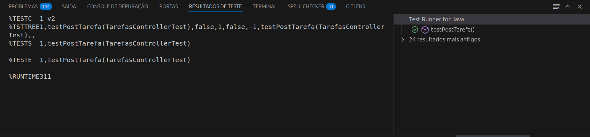

### Barema:

|Elemento | Valor|
|---------|------|
|**Identificador do Teste** | `1`|
|**Descrição** | `Verifica se uma tarefa é criada e persistida com sucesso` |
|**Status**	 | `✅ Passou`|
|**Ignorado** | `Não` |
|**Tempo de Execução**	| `311ms` |
|**Exceções Lançadas**	| `Nenhuma` |
|**Comentário** | `A tarefa foi criada, persistida e validada com sucesso` |
|**Descrição de Falhas**| `Nenhuma falha identificada.` |
|**Sugestão de Melhorias**| `Nenhuma.`|

---

## CT2 - Teste de Cadastro de tarefa inválida `(testPostTarefaFalha())`

### V 1.10

#### Evidências:

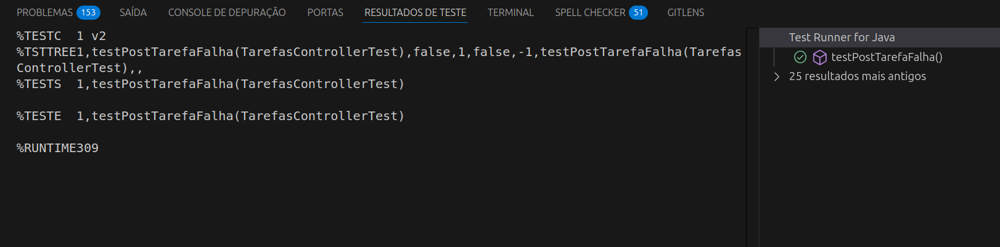

#### Barema:

| Elemento                  | Valor                                                                 |
|---------------------------|-----------------------------------------------------------------------|
| **Identificador do Teste**| `2`                                                                   |
| **Descrição**             | `Verifica se o sistema rejeita tarefa com título e descrição vazios` |
| **Status**                | `✅ Passou`                                                            |
| **Ignorado**              | `Não`                                                                 |
| **Tempo de Execução**     | `309ms`                                                               |
| **Exceções Lançadas**     | `IllegalArgumentException`                                            |
| **Comentário**            | `O sistema lançou a exceção esperada para dados inválidos, validando a integridade dos dados de entrada.` |
| **Descrição de Falhas**   | `Nenhuma falha identificada.`                                         |
| **Sugestão de Melhorias** | `Em caso de visualização, as mensagens de erro, devem mais descritivas ao usuário final.`         |

### V 2.0

#### Evidências:

#### Barema:

| Elemento                  | Valor                                                                 |
|---------------------------|-----------------------------------------------------------------------|
| **Identificador do Teste**| `2`                                                                   |
| **Descrição**             | `Verifica se o sistema rejeita tarefa com título e descrição vazios.`|
| **Status**                | `✅ Passou`                                                            |
| **Ignorado**              | `Não`                                                                 |
| **Tempo de Execução**     | `352ms`                                                               |
| **Exceções Lançadas**     | `IllegalArgumentException`                                            |
| **Comentário**            | `O sistema lançou a exceção esperada ao receber dados inválidos, validando corretamente a regra de negócio.` |
| **Descrição de Falhas**   | `Nenhuma falha identificada.`                                         |
| **Sugestão de Melhorias** | `Nenhuma melhoria sugerida` |

---

## CT3 - Teste de Conclusão de Tarefa `(testConcluirTarefa())`

### V 1.10

#### Evidências:

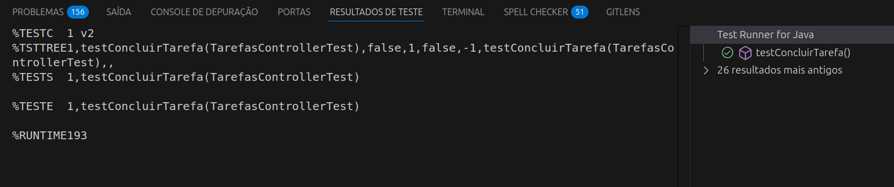

#### Barema:

| Elemento                  | Valor                                                                 |
|---------------------------|-----------------------------------------------------------------------|
| **Identificador do Teste**| `3`                                                                   |
| **Descrição**             | `Verifica se uma tarefa é corretamente marcada como concluída`       |
| **Status**                | `✅ Passou`                                                            |
| **Ignorado**              | `Não`                                                                 |
| **Tempo de Execução**     | `193ms`                                                               |
| **Exceções Lançadas**     | `Nenhuma`                                                             |
| **Comentário**            | `A tarefa foi criada, concluída e o status foi atualizado com sucesso.` |
| **Descrição de Falhas**   | `Nenhuma falha identificada.`                                         |
| **Sugestão de Melhorias** | `Nenhuma.`                                                            |

### V 2.0

#### Evidências:

#### Barema:

| Elemento                  | Valor                                                                 |
|---------------------------|-----------------------------------------------------------------------|
| **Identificador do Teste**| `3`                                                                   |
| **Descrição**             | `Verifica se uma tarefa é corretamente marcada como concluída.`      |
| **Status**                | `✅ Passou`                                                            |
| **Ignorado**              | `Não`                                                                 |
| **Tempo de Execução**     | `250ms`                                                               |
| **Exceções Lançadas**     | `Nenhuma`                                                             |
| **Comentário**            | `A tarefa foi criada, concluída e o status atualizado com sucesso.`  |
| **Descrição de Falhas**   | `Nenhuma falha identificada.`                                         |
| **Sugestão de Melhorias** | `Nenhuma.` |

---

## CT4 - Teste de Listagem de Tarefas `(testGetTarefas())`

### Evidências:

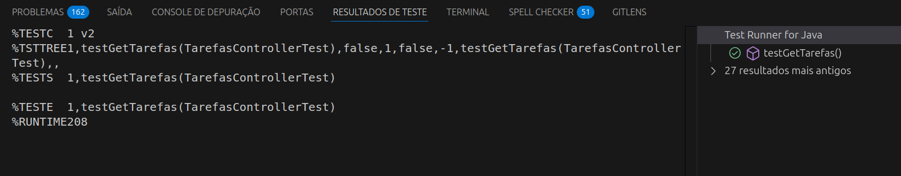

### Barema:

| Elemento                  | Valor                                                                  |
|---------------------------|------------------------------------------------------------------------|
| **Identificador do Teste**| `4`                                                                    |
| **Descrição**             | `Verifica se a listagem de tarefas retorna corretamente os registros` |
| **Status**                | `✅ Passou`                                                             |
| **Ignorado**              | `Não`                                                                  |
| **Tempo de Execução**     | `208ms`                                                                |
| **Exceções Lançadas**     | `Nenhuma`                                                              |
| **Comentário**            | `As tarefas foram cadastradas e corretamente listadas pela aplicação.` |
| **Descrição de Falhas**   | `Nenhuma falha identificada.`                                          |
| **Sugestão de Melhorias** | `Nenhuma.`                                                             |

---

## CT5 - Teste de Busca de Tarefa por ID `(testGetTarefaById())`

### Evidências:

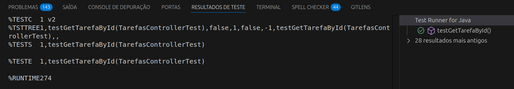

### Barema:

| Elemento                  | Valor                                                                 |
|---------------------------|-----------------------------------------------------------------------|
| **Identificador do Teste**| `5`                                                                   |
| **Descrição**             | `Verifica se a tarefa é corretamente recuperada com base no ID`      |
| **Status**                | `✅ Passou`                                                           |
| **Ignorado**              | `Não`                                                                 |
| **Tempo de Execução**     | `274ms`                                                               |
| **Exceções Lançadas**     | `Nenhuma`                                                             |
| **Comentário**            | `A tarefa foi localizada com sucesso utilizando seu identificador.`  |
| **Descrição de Falhas**   | `Nenhuma falha identificada.`                                         |
| **Sugestão de Melhorias** | `Nenhuma.`                                                            |

---

## CT6 - Teste de Busca por ID inválido `(testGetTarefaByIdInvalido())`

### V 1.10

#### Evidências:

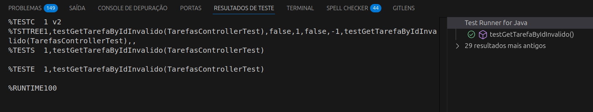

#### Barema:

| Elemento                  | Valor                                                                 |
|---------------------------|-----------------------------------------------------------------------|
| **Identificador do Teste**| `6`                                                                   |
| **Descrição**             | `Verifica o tratamento da tentativa de recuperar uma tarefa com ID inexistente.` |
| **Status**                | `✅ Passou`                                                           |
| **Ignorado**              | `Não`                                                                 |
| **Tempo de Execução**     | `100ms`                                                               |
| **Exceções Lançadas**     | `IllegalArgumentException: Tarefa com ID 999 não encontrada.`         |
| **Comentário**            | `O sistema lançou corretamente a exceção esperada ao buscar uma tarefa inexistente.` |
| **Descrição de Falhas**   | `Nenhuma falha identificada.`                                         |
| **Sugestão de Melhorias** | `Em caso de visualização, as mensagens de erro, devem mais descritivas ao usuário final.` |

### V 2.0

#### Evidências:

#### Barema:

| Elemento                  | Valor                                                                 |
|---------------------------|-----------------------------------------------------------------------|
| **Identificador do Teste**| `6`                                                                   |
| **Descrição**             | `Verifica o tratamento da tentativa de recuperar uma tarefa com ID inexistente.` |
| **Status**                | `✅ Passou`                                                            |
| **Ignorado**              | `Não`                                                                 |
| **Tempo de Execução**     | `127ms`                                                               |
| **Exceções Lançadas**     | `IllegalArgumentException: Tarefa com ID 999 não encontrada.`         |
| **Comentário**            | `O sistema lançou corretamente a exceção esperada ao buscar uma tarefa inexistente.` |
| **Descrição de Falhas**   | `Nenhuma falha identificada.`                                         |
| **Sugestão de Melhorias** | `Nenhuma sugerida` |

---

## CT7 - Teste de Remoção de Tarefa `(testRemoverTarefa())`

### V 1.10

#### Evidências:

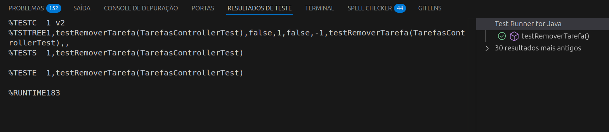

#### Barema:

| Elemento                  | Valor                                                                 |
|---------------------------|-----------------------------------------------------------------------|
| **Identificador do Teste**| `7`                                                                   |
| **Descrição**             | `Verifica se uma tarefa é removida com sucesso e validada após remoção.` |
| **Status**                | `✅ Passou`                                                           |
| **Ignorado**              | `Não`                                                                 |
| **Tempo de Execução**     | `183ms`                                                               |
| **Exceções Lançadas**     | `Nenhuma`                                                             |
| **Comentário**            | `A tarefa foi removida corretamente e não foi mais encontrada.`       |
| **Descrição de Falhas**   | `Nenhuma falha identificada.`                                         |
| **Sugestão de Melhorias** | `Nenhuma.`                                                            |

### V 2.0

#### Evidências:

#### Barema:

| Elemento                  | Valor                                                                 |
|---------------------------|-----------------------------------------------------------------------|
| **Identificador do Teste**| `7`                                                                   |
| **Descrição**             | `Verifica se uma tarefa é removida com sucesso e validada após remoção.` |
| **Status**                | `✅ Passou`                                                           |
| **Ignorado**              | `Não`                                                                 |
| **Tempo de Execução**     | `205ms`                                                               |
| **Exceções Lançadas**     | `Nenhuma`                                                             |
| **Comentário**            | `A tarefa foi removida corretamente e não foi mais encontrada.`       |
| **Descrição de Falhas**   | `Nenhuma falha identificada.`                                         |
| **Sugestão de Melhorias** | `Nenhuma.`                                                            |

---

## CT8 - Teste de Remoção de Tarefa Inválida `(testRemoverTarefaInvalida())`

### V 1.10

#### Evidências:

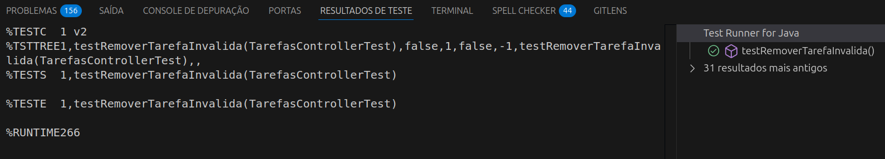

#### Barema:

| Elemento                  | Valor                                                                 |
|---------------------------|-----------------------------------------------------------------------|
| **Identificador do Teste**| `8`                                                                   |
| **Descrição**             | `Verifica se ao tentar remover uma tarefa que não foi cadastrada, a exceção esperada é lançada.` |
| **Status**                | `✅ Passou`                                                           |
| **Ignorado**              | `Não`                                                                 |
| **Tempo de Execução**     | `266ms`                                                               |
| **Exceções Lançadas**     | `IllegalArgumentException`                                            |
| **Comentário**            | `A exceção foi corretamente lançada, indicando que não é possível remover uma tarefa não cadastrada.` |
| **Descrição de Falhas**   | `Nenhuma falha identificada.`                                         |
| **Sugestão de Melhorias** | `Nenhuma.`                                                            |

### V 2.0

#### Evidências:

#### Barema:

| Elemento                  | Valor                                                                 |
|---------------------------|-----------------------------------------------------------------------|
| **Identificador do Teste**| `8`                                                                   |
| **Descrição**             | `Verifica se ao tentar remover uma tarefa que não foi cadastrada, a exceção esperada é lançada.` |
| **Status**                | `✅ Passou`                                                           |
| **Ignorado**              | `Não`                                                                 |
| **Tempo de Execução**     | `385ms`                                                               |
| **Exceções Lançadas**     | `IllegalArgumentException`                                            |
| **Comentário**            | `A exceção foi corretamente lançada, indicando que não é possível remover uma tarefa não cadastrada.` |
| **Descrição de Falhas**   | `Nenhuma falha identificada.`                                         |
| **Sugestão de Melhorias** | `Nenhuma.` |

---

## CT9 - Teste de Atualização de Tarefa `(testAtualizarTarefa())`

### Evidências:

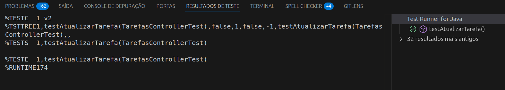

### Barema:

| Elemento                  | Valor                                                                 |
|---------------------------|-----------------------------------------------------------------------|
| **Identificador do Teste**| `9`                                                                   |
| **Descrição**             | `Verifica se uma tarefa é atualizada corretamente.`                  |
| **Status**                | `✅ Passou`                                                           |
| **Ignorado**              | `Não`                                                                 |
| **Tempo de Execução**     | `174ms`                                                               |
| **Exceções Lançadas**     | `Nenhuma`                                                             |
| **Comentário**            | `A tarefa foi atualizada com sucesso, e o título foi alterado como esperado.` |
| **Descrição de Falhas**   | `Nenhuma falha identificada.`                                         |
| **Sugestão de Melhorias** | `Nenhuma.`                                                            |

---

## CT10 - Teste de Atualização de Tarefa Inválida `(testAtualizarTarefaInvalida())`

### V 1.10

#### Evidências:

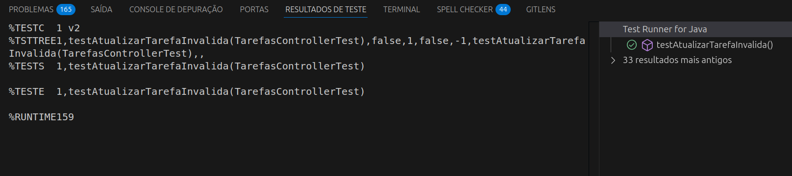

#### Barema:

| Elemento                  | Valor                                                                 |
|---------------------------|-----------------------------------------------------------------------|
| **Identificador do Teste**| `10`                                                                  |
| **Descrição**             | `Verifica o comportamento do sistema ao tentar atualizar uma tarefa não cadastrada.` |
| **Status**                | `✅ Passou`                                                           |
| **Ignorado**              | `Não`                                                                 |
| **Tempo de Execução**     | `159ms`                                                               |
| **Exceções Lançadas**     | `IllegalArgumentException`                                            |
| **Comentário**            | `O sistema se comportou conforme esperado, lançando a exceção de argumento inválido.` |
| **Descrição de Falhas**   | `Nenhuma falha identificada.`                                         |
| **Sugestão de Melhorias** | `Nenhuma.`                                                            |

### V 2.0

#### Evidências:

#### Barema:

| Elemento                  | Valor                                                                 |
|---------------------------|-----------------------------------------------------------------------|
| **Identificador do Teste**| `10`                                                                  |
| **Descrição**             | `Verifica o comportamento do sistema ao tentar atualizar uma tarefa não cadastrada.` |
| **Status**                | `✅ Passou`                                                           |
| **Ignorado**              | `Não`                                                                 |
| **Tempo de Execução**     | `225ms`                                                               |
| **Exceções Lançadas**     | `IllegalArgumentException`                                            |
| **Comentário**            | `O sistema se comportou conforme esperado, lançando a exceção de argumento inválido.` |
| **Descrição de Falhas**   | `Nenhuma falha identificada.`                                         |
| **Sugestão de Melhorias** | `Nenhuma.`  |

---

## CT11 - Conjunto de Testes para o Controller de Tarefas `(TarefasControllerTest)`

### V 1.10

#### Evidências:

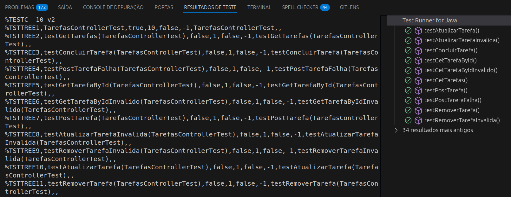

#### Barema:

| Elemento                  | Valor                                                                 |
|---------------------------|-----------------------------------------------------------------------|
| **Identificador do Teste**| `11`                                                                  |
| **Descrição**             | `Execução de um conjunto de testes no controlador de tarefas para verificar as funcionalidades de CRUD e de gerenciamento de tarefas.` |
| **Status**                | `✅ Passaram todos os testes`                                         |
| **Ignorado**              | `Não`                                                                 |
| **Tempo de Execução**     | `324ms`                                                               |
| **Exceções Lançadas**     | `Nenhuma` (Todos os testes passaram, até os com exceções esperadas)                    |
| **Comentário**            | `O conjunto de testes executou com sucesso todas as funcionalidades do controlador de tarefas, verificando desde a criação, atualização e remoção até o tratamento de falhas.` |
| **Descrição de Falhas**   | `Nenhuma falha identificada.`                                         |
| **Sugestão de Melhorias** | `Nenhuma.`                                                            |

### V 2.0

#### Evidências:

#### Barema:

| Elemento                  | Valor                                                                 |
|---------------------------|-----------------------------------------------------------------------|
| **Identificador do Teste**| `11`                                                                  |
| **Descrição**             | `Execução de um conjunto de testes no controlador de tarefas para verificar as funcionalidades de CRUD e de gerenciamento de tarefas.` |
| **Status**                | `✅ Passaram todos os testes`                                         |
| **Ignorado**              | `Não`                                                                 |
| **Tempo de Execução**     | `367ms`                                                               |
| **Exceções Lançadas**     | `Nenhuma` (Todos os testes passaram, incluindo os que lançam exceções esperadas) |
| **Comentário**            | `O conjunto de testes executou com sucesso todas as funcionalidades do controlador de tarefas, cobrindo operações válidas e inválidas de criação, recuperação, atualização, remoção e conclusão de tarefas.` |
| **Descrição de Falhas**   | `Nenhuma falha identificada.`                                         |
| **Sugestão de Melhorias** | `Nenhuma Sugerida` |

[Voltar Principal](../../README.md)

---